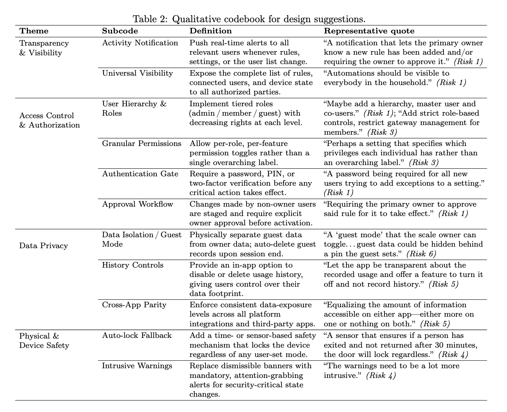

# Study B: Online Survey & Qualitative Codebook

## Overview

Study B is a video-based online survey that investigates how users perceive security and privacy risks in multi-user smart home configurations. Participants watch a short video (~1-2 min) depicting a smart home scenario involving potential configuration risks, then complete a brief questionnaire (~5 min total).

## Survey Instrument

See [StudyB.pdf](StudyB.pdf) for the full questionnaire. The survey consists of:

1. **Informed Consent** -- voluntary participation, anonymous responses, no identifiable information collected.
2. **Video Stimulus** -- participants view a scenario video illustrating a multi-user IoT configuration risk.
3. **Attention Check** -- a factual question about the primary device shown in the video.
4. **Risk Perception Rating** -- a 5-point Likert-type item (Not at all risky -- Extremely risky).
5. **Open-Ended Questions** -- two short-answer items asking participants to (a) explain the reasoning behind their risk rating and (b) suggest additional features or interface designs that could mitigate the identified risk.

## Qualitative Codebook

The codebook above was developed through thematic analysis of participants' open-ended design suggestions (Question 3). It organizes responses into four high-level themes and eleven subcodes:

| Theme | Subcodes |
|---|---|
| **Transparency & Visibility** | Activity Notification, Universal Visibility |
| **Access Control & Authorization** | User Hierarchy & Roles, Granular Permissions, Authentication Gate, Approval Workflow |
| **Data Privacy** | Data Isolation / Guest Mode, History Controls, Cross-App Parity |
| **Physical & Device Safety** | Auto-lock Fallback, Intrusive Warnings |

Each subcode includes a definition and a representative participant quote linked to the specific risk scenario it addresses.
